<picture>
  <source media="(prefers-color-scheme: light)" srcset="./assets/banner-about-light.svg">
  
</picture>

  

<picture>
  <source media="(prefers-color-scheme: light)" srcset="./assets/focus-areas-light.svg">
  
</picture>

<picture>

  <source media="(prefers-color-scheme: light)" srcset="./assets/github-stats-light.svg">
  
</picture>

<picture>
  <source media="(prefers-color-scheme: light)" srcset="https://raw.githubusercontent.com/cyprieng/github-breakout/main/example/light.svg" />
  
</picture>

## 💭 Wisdom, Compiled Randomly

### ⭐ Thanks for stopping by!

 

 

 

 

